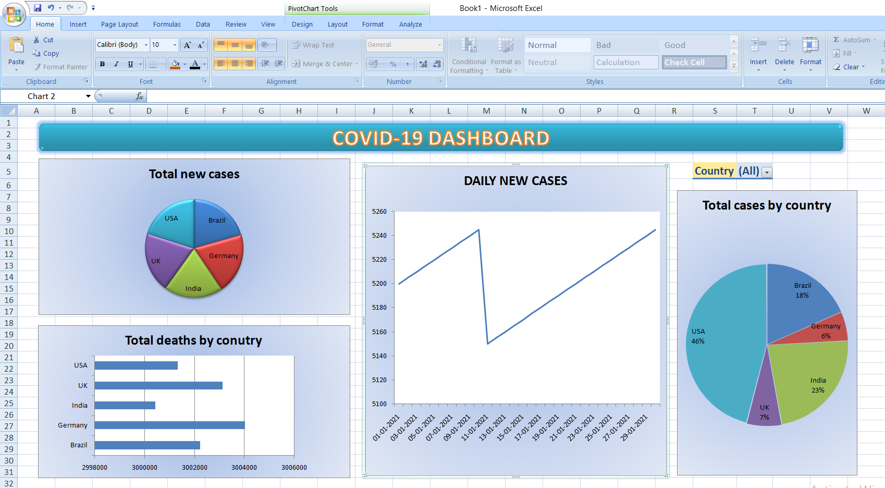

# 🦠 COVID-19 Data Analysis - Excel Dashboard

## 📊 Project Overview
This project analyzes COVID-19 trends across five countries using Microsoft Excel. It includes interactive pivot tables, charts, and slicers to provide meaningful insights from public-like sample data.

## 📁 Files Included
- `COVID19_Analysis_Sample.xlsx` – Cleaned dataset with COVID-19 data for India, USA, Brazil, UK, and Germany
- `covid_dashboard.png` – Screenshot of the Excel dashboard showing charts and slicers
- `README.md` – This documentation

## 🔧 Tools Used
- Microsoft Excel (Pivot Tables & Charts)
- Slicers for interactive filtering
- Data cleaning and visualization

## 📈 Key Insights from Dashboard
- 📅 Daily new cases trend over time
- 🌍 Total and new cases by country (pie charts)
- ⚰️ Total deaths comparison (bar chart)
- 🔘 Slicer for filtering by country

## 📸 Dashboard Preview

## 🌐 Dataset Info
This is a sample dataset generated for practice purposes, inspired by publicly available COVID-19 data from [Our World in Data](https://ourworldindata.org/covid-deaths).  
No sensitive or private data is included.

## 👩‍💻 About Me
I'm **Pavani Nagu**, an aspiring Data Analyst with skills in Excel, Power BI, Tableau, and Python. This project demonstrates my ability to build visual dashboards, analyze real-world data, and present insights effectively.

---

⭐ **Thank you for viewing this project!** Feel free to connect with me on [GitHub](https://github.com/pavani-nagu) or [LinkedIn](https://linkedin.com/in/pavani-nagu-yarramsetti-2b64bb263).
